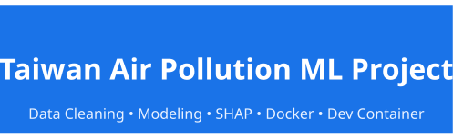

<p align="center">
  
</p>

# 🚀 Taiwan Air Pollution ML Project (2016–2024)

📊 End-to-End Machine Learning Pipeline for Air Quality Modeling

Data Cleaning • Feature Engineering • Modeling • SHAP • Evaluation • Docker • Dev Container

<p align="center">
  <!-- Environment / Tooling -->
  
  
  
  
  
  
  

  <!-- Repo Info -->
  
  
  
  
</p>

---

# 📑 Table of Contents

- [Overview](#overview)
- [Data Source](#-data-source)
- [Docker Support](#-docker-support-python-313)
- [VSCode Dev Container](#-vscode-dev-container-recommended)
- [Mounted Folders](#-mounted-folders)
- [Environment Replication](#-environment-replication-reproducible-jupyter-environment)
- [Project Layout](#-project-layout)
- [Notebook / Chapter Overview](#-notebook--chapter-overview)
- [Field Summary](#-field-summary)
- [Future Work](#-future-work-planning)
- [ML Workflow Architecture](#-full-ml-workflow-architecture)
- [License](#-license)

---

## Overview

This project provides a full machine-learning workflow to analyze Taiwan’s air quality data (2016–2024):

✔ Data cleaning

✔ Feature engineering (rolling windows, log transforms, scaling)

✔ Baseline & nonlinear models

✔ Hyperparameter tuning (RandomSearch + GridSearch)

✔ Model explainability (SHAP TreeExplainer)

✔ Evaluation & visualization

✔ Reproducible environment via Docker + Dev Container

## 📂 Data Source

- Dataset: **"Taiwan Air Quality Data (2016–2024)"** from Kaggle  
- Download and place the CSV at: `data/raw/air_quality.csv`  

---

## 🐳 Docker Support (Python 3.13)

The project supports Docker to guarantee a reproducible, isolated, and dependency-consistent ML environment.

### 🔧 1. Build Image

```nginx
docker build -t air_pollution .
```

### 🔧 2. Start a Development Shell

```ruby
docker run -it \
  -v $(pwd):/app \
  air_pollution bash
```

You can now run:

```bash
python src/main_cleaning.py
python src/main_modeling.py
python src/main_visualization.py
```

## 🧰 VSCode Dev Container (Recommended)

Best development experience.

Automatically sets up Python 3.13 + Poetry + Jupyter inside Docker.

### 🔧 1. Install VSCode extension

Dev Containers

### 🔧 2. Run

```css
Ctrl + Shift + P → Dev Containers: Reopen in Container
```

### 3. VSCode will automatically

- build image

- mount your workspace

- install Poetry dependencies

- configure Python environment

Now you can run any .py or notebook directly inside the container.

### 📂 Mounted Folders

| Local Folder      | Container Path | Description                                |
| ----------------- | -------------- | ------------------------------------------ |
| `.` (All Project) | `/app`         | Source code + data + models 全部會掛進容器 |

## 🧪 Environment Replication (Reproducible Jupyter Environment)

### 🔧 1. Build Replication Image

```bash
docker build -f Dockerfile.repro -t air_pollution_repro .
```

### 🔧 2. Start Jupyter Lab for Notebook Reproduction

```bash
docker run -p 8888:8888 air_pollution_repro
```

You will see:

```ruby
http://127.0.0.1:8888/?token=xxxxxxxx
```

Click link to continue.

---

## 📁 Project Layout

```text
.
├─ data/
│  ├─ raw/                # 原始資料 (air_quality.csv)
│  └─ processed/          # 清理後資料
│
├─ models/                # 訓練後的模型 & scaler
│  ├─ linear/
|  ├─ rf/
|  ├─ rf_tuned/
│
├─ notebook/              # Jupyter Notebook 分章呈現
│  ├─ 01_data_cleaning_check.ipynb
│  ├─ 02_feature_check.ipynb
│  ├─ 03_baseline_modeling.ipynb
│  ├─ 04_nonlinear_modeling.ipynb
│  ├─ 05_model_optimization.ipynb
│  ├─ 06_model_explainability_shap_analysis.ipynb
│  └─ 07_model_prediction_evaluation.ipynb
│
├─ output/
│  ├─ figures/            # SHAP / EDA / 模型圖表
|     ├─ linear/
|     ├─ rf/
|     ├─ rf_tuned/
│  └─ predictions/        # 模型預測輸出
│
├─ result/                # CV 結果、tuning log、metrics
│
├─ src/
│  ├─ cleaning/           # 資料清理函式
│  ├─ features/           # 特徵工程 (rolling, log, scaling)
│  ├─ modeling/           # Baseline, RF, Tuning, SHAP
│  ├─ utils/              # 工具 (emoji_log, IO, path)
│  ├─ visualization/      # 圖表繪製
│  ├─ config.py
│  ├─ main_cleaning.py
│  ├─ main_modeling.py
│  └─ main_visualization.py
│
├─ pyproject.toml
├─ poetry.lock
├─ Dockerfile
├─ .dockerignore
└─ README.md
```

---

## 📘 Notebook / Chapter Overview

以下為各章節 Notebook 的角色與內容摘要。

### **Chapter 01 — Data Cleaning Quality Check**  

📓 `01_data_cleaning_check.ipynb`

- 檢查資料品質（缺值、重複、異常值）
- 日期格式、測站資料一致性
- 氣體／微粒污染物範圍 sanity check
- 初步資料分布與相關分析
- 產出：**processed 清理後資料**

---

### **Chapter 02 — Feature Engineering Verification**  

📓 `02_feature_check.ipynb`

- 檢查 rolling features（3d/7d）
- log-transform 後的分布變化
- 特徵與 AQI 的初步關聯（correlation / scatter）
- 特徵 dtype、缺值、合理性驗證
- 產出：**最終特徵欄位列表**

---

### **Chapter 03 — Baseline Modeling (Linear Regression)**  

📓 `03_baseline_modeling.ipynb`

- Linear Regression baseline  
- 訓練 + 評估 (MAE, RMSE, R²)
- baseline 模型保存（pkl）
- 作為後續 RF 與 tuning 的比較基準

---

### **Chapter 04 — Nonlinear Modeling (Random Forest)**  

📓 `04_nonlinear_modeling.ipynb`

- Random Forest 回歸模型  
- 初步 feature_importances_  
- 預測 vs 實際（散佈圖）  
- 殘差分析（error distribution）
- RF 初版效能瓶頸診斷
- 為 tuning 打基礎

---

### **Chapter 05 — Model Optimization & Hyperparameter Tuning**  

📓 `05_model_optimization.ipynb`

- RandomizedSearchCV：大範圍快速搜尋  
- GridSearchCV（subsample=0.3）提升 3–5 倍速度  
- 動態搜尋空間（依 RandomSearch 最佳參數縮小）
- 比較：初版 RF vs RandomSearch RF vs GridSearch RF
- Final model：最佳參數 + 全資料訓練
- 輸出：**最佳模型、metrics、CV 結果**

---

### **Chapter 06 — Model Explainability (SHAP Analysis)**  

📓 `06_model_explainability_shap_analysis.ipynb`

- SHAP TreeExplainer on Final RF  
- **SHAP Summary Plot**（全域特徵重要性）  
- **SHAP Bar Plot**（平均貢獻度）  
- **SHAP Dependence Plot**：分析特徵影響方向  
  - 例：pm2.5 ↑ → SHAP ↑ → AQI ↑  
- 單筆預測的 force/waterfall plot  
- 找出模型真正依賴的特徵  
- 將 SHAP 結果連結到環境領域知識（大氣科學）

---

### **Chapter 07 — Prediction Evaluation & Final Reporting**  

📓 `07_model_prediction_evaluation.ipynb`

- Final model vs Baseline vs RF 初版  
- y_true vs y_pred（模型擬合度）  
- 殘差 vs AQI（檢查模型偏差）  
- 高濃度污染事件的預測能力  
- MAE / RMSE / R² 總結  
- 實務洞察：  
  - 一般污染情況預測穩定  
  - 高污染尖峰事件仍具有挑戰  
- 產出：最終模型報告、重要圖表、預測結果

---

## 🧪 Field Summary

| Field                       | Description  |
| --------------------------- | ------------ |
| `date`                      | 日期時間     |
| `sitename`                  | 測站名稱     |
| `county`                    | 縣市         |
| `aqi`                       | 空氣品質指標 |
| `pollutant`                 | 主要污染物   |
| `so2`, `co`, `o3`, `o3_8hr` | 氣體污染物   |
| `pm10`, `pm2.5`             | 懸浮微粒濃度 |
| `windspeed`, `winddirec`    | 風速／風向   |
| `longitude`, `latitude`     | GPS          |
| `siteid`                    | 測站 ID      |

## 📝 Future Work (Planning)

- LightGBM / CatBoost / XGBoost

- 空氣品質時序模型（LSTM、Prophet）

- 特徵交互項（例如風向 × PM2.5）

- 使用 SHAP 反向改善特徵工程

- 模型部署（Streamlit）

- Geo-spatial Mapping（AQI 地圖熱點分析）

---

## 🧩 Full ML Workflow Architecture

```mermaid
flowchart TD

%% ============================
%% COLOR THEMES + ROUNDED CORNERS
%% ============================
classDef cleaning fill:#BBDEFB,stroke:#0D47A1,stroke-width:1px,color:#0D47A1,rx:10,ry:10
classDef fe fill:#DCEDC8,stroke:#33691E,stroke-width:1px,color:#1B5E20,rx:10,ry:10
classDef modeling fill:#FFE0B2,stroke:#E65100,stroke-width:1px,color:#E65100,rx:10,ry:10
classDef shap fill:#F8BBD0,stroke:#AD1457,stroke-width:1px,color:#880E4F,rx:10,ry:10
classDef eval fill:#D1C4E9,stroke:#4527A0,stroke-width:1px,color:#311B92,rx:10,ry:10
classDef save fill:#CFD8DC,stroke:#37474F,stroke-width:1px,color:#263238,rx:10,ry:10

%% ============================
%% NODES
%% ============================

A["Raw Air Quality Data<br>CSV 2016–2024"]

%% Cleaning Group
subgraph CLEANING[Data Cleaning]
    B1["Data Cleaning Step"]
    B2["Remove Invalid Rows<br>Null / Duplicates"]
    B3["Datetime Parsing<br>& Sorting"]
end

%% Feature Engineering Group
subgraph FE[Feature Engineering]
    C1["Start Feature Engineering"]
    C2["Outlier Handling<br>Clip · IQR"]
    C3["Rolling Features<br>3-day · 7-day"]
    C4["Log Transform<br>log1p"]
    D1["Feature Selection<br>Build X, y"]
    D2["Train/Test Split<br>80/20"]
    D3["Scaling<br>StandardScaler (train-only)"]
end

%% Modeling Group
subgraph MODELING[Modeling & Tuning]
    E1["Baseline Model<br>Linear Regression"]
    E2["Random Forest Model"]
    E3["Hyperparameter Tuning<br>RandomSearch + GridSearch"]
    E4["Final RF Model"]
end

%% SHAP Group
subgraph SHAP[Model Explainability]
    F1["SHAP Values<br>TreeExplainer"]
    F2["SHAP Summary<br>Dependence · Force"]
end

%% Evaluation Group
subgraph EVAL[Prediction Evaluation]
    G1["Prediction Evaluation"]
    G2["y_true vs y_pred"]
    G3["Residual Analysis<br>Error Distribution"]
    G4["Final Metrics Export"]
end

H["Save Model & Report<br>pkl · json · figures"]

%% ============================
%% FLOWS
%% ============================

A --> B1
B1 --> B2 --> B3 --> C1
C1 --> C2 --> C3 --> C4 --> D1 --> D2 --> D3

D3 --> E1 --> E2 --> E3 --> E4
E4 --> F1 --> F2 --> G1 --> G2 --> G3 --> G4 --> H

%% ============================
%% CLASS ASSIGNMENTS
%% ============================

class B1,B2,B3 cleaning
class C1,C2,C3,C4,D1,D2,D3 fe
class E1,E2,E3,E4 modeling
class F1,F2 shap
class G1,G2,G3,G4 eval
class H save
```



---

## 📜 License

MIT License (free to use & modify)
