<p align="center">
  
</p>

# 🚀 Taiwan Air Pollution ML Project (2016–2024)

📊 End-to-End Machine Learning Pipeline for Air Quality Modeling

Data Cleaning • Feature Engineering • Modeling • SHAP • Evaluation • Docker • Dev Container

<p align="center">
  <!-- Environment / Tooling -->
  
  
  
  
  
  
  
  

  <!-- Repo Info -->
  
  
  
  
</p>

---

# 📑 Table of Contents

- [Overview](#overview)
- [Data Source](#-data-source)
- [Docker Support](#-docker-support-python-313)
- [VSCode Dev Container](#-vscode-dev-container-recommended)
- [Mounted Folders](#-mounted-folders)
- [Project Layout](#-project-layout)
- [Usage](#-usage)
- [Notebook / Chapter Overview](#-notebook--chapter-overview)
- [Web Application Deployment](#-web-application-deployment-time-machine)
- [CI/CD Pipeline](#-cicd-pipeline)
- [Field Summary](#-field-summary)
- [Future Work](#-future-work-planning)
- [ML Workflow Architecture](#-full-ml-workflow-architecture)
- [License](#-license)

---

## Overview

This project provides a full machine-learning workflow to analyze Taiwan’s air quality data (2016–2024):

✔ Data cleaning

✔ Feature engineering (rolling windows, log transforms, scaling)

✔ Baseline & nonlinear models (Linear, Random Forest, LightGBM)

✔ Hyperparameter tuning (RandomSearch + GridSearch)

✔ Model explainability (SHAP TreeExplainer)

✔ Evaluation & visualization

✔ Reproducible environment via Docker + Dev Container

## 📂 Data Source

- Dataset: **"Taiwan Air Quality Data (2016–2024)"** from Kaggle  
- Download and place the CSV at: `data/raw/air_quality.csv`  

---

## 🐳 Docker Support (Python 3.13)

The project supports Docker to guarantee a reproducible, isolated, and dependency-consistent ML environment.

> **📌 Note**: This Dockerfile uses **bind mount** strategy. Project files are NOT copied into the image, but mounted at runtime for instant synchronization between host and container.

### 🔧 1. Build Image

```bash
docker build -t air_pollution .
```

### 🔧 2. Start a Development Shell

```bash
docker run -it \
  -v $(pwd):/app \
  air_pollution bash
```

**What happens:**

- `-v $(pwd):/app`: Mounts your current directory to `/app` in the container (bind mount)
- Any file changes on your host are **instantly visible** in the container
- Any changes made in the container are **reflected on your host**
- No need to rebuild image when code changes

You can now run:

```bash
python src/main_cleaning.py
python src/main_modeling.py
python src/main_visualization.py
```

## 🧰 VSCode Dev Container (Recommended)

Best development experience.

Automatically sets up Python 3.13 + Poetry + Jupyter inside Docker.

### 🔧 1. Install VSCode extension

Dev Containers

### 🔧 2. Run

```css
Ctrl + Shift + P → Dev Containers: Reopen in Container
```

### 3. VSCode will automatically

- build image

- mount your workspace

- install Poetry dependencies

- configure Python environment

Now you can run any .py or notebook directly inside the container.

### 📂 Mounted Folders (Bind Mount)

Both Docker and Dev Container use **bind mount** to synchronize files:

| Local Folder      | Container Path | Sync Type      | Description                                      |
| ----------------- | -------------- | -------------- | ------------------------------------------------ |
| `.` (All Project) | `/app`         | Bi-directional | Source code + data + models 全部會掛進容器,雙向即時同步 |

**Benefits of Bind Mount:**

- ✅ Edit code on host with your favorite IDE → Run in container immediately
- ✅ Generate outputs in container → Instantly available on host
- ✅ No need to rebuild image when code changes
- ✅ Consistent development experience across team members

---

## 📁 Project Layout

```text
.
├─ data/
│  ├─ raw/                # 原始資料 (air_quality.csv)
│  └─ processed/          # 清理後資料
│
├─ models/                # 訓練後的模型 & scaler
│  ├─ linear/
|  ├─ rf/
|  ├─ rf_tuned/
│
├─ notebook/              # Jupyter Notebook 分章呈現
│  ├─ 01_data_cleaning_check.ipynb
│  ├─ 02_feature_check.ipynb
│  ├─ 03_baseline_modeling.ipynb
│  ├─ 04_nonlinear_modeling.ipynb
│  ├─ 05_model_optimization.ipynb
│  ├─ 06_model_explainability_shap_analysis.ipynb
│  ├─ 07_model_prediction_evaluation.ipynb
│  ├─ 08_advanced_boosting_lightgbm.ipynb
│  ├─ 09_temporal_analysis.ipynb
│  └─ 10_time_series_lstm.ipynb
│
├─ output/
│  ├─ figures/            # SHAP / EDA / 模型圖表
│  │  ├─ linear/
│  │  ├─ rf/
│  │  ├─ rf_tuned/
│  │  ├─ lgbm/
│  │  └─ lstm/
│  └─ predictions/        # 模型預測輸出
│
├─ result/                # CV 結果、tuning log、metrics
│
├─ src/
│  ├─ app/                # Streamlit Web App
│  ├─ cleaning/           # 資料清理函式
│  ├─ features/           # 特徵工程 (rolling, log, scaling)
│  ├─ modeling/           # Baseline, RF, Tuning, SHAP, LightGBM, LSTM
│  ├─ utils/              # 工具 (emoji_log, IO, path)
│  ├─ visualization/      # 圖表繪製
│  ├─ config.py
│  ├─ main_cleaning.py
│  ├─ main_modeling.py
│  └─ main_visualization.py
│
├─ pyproject.toml
├─ poetry.lock
├─ Dockerfile
├─ .dockerignore
└─ README.md
```

---

## 🔧 Usage

### **1. Data Cleaning**

Process raw CSV data into cleaned Parquet format.

```bash
python src/main_cleaning.py
```

### **2. Visualization**

Generate exploratory data analysis (EDA) plots.

```bash
python src/main_visualization.py
```

### **3. Run Modeling Pipeline**

Train and evaluate models using the automated pipeline.

**Option A: Random Forest (Default)**

```bash
python -c "from src.main_modeling import run_model_pipeline; run_model_pipeline('Taiwan', model_type='rf_tuned')"
```

**Option B: LightGBM (Fast & Accurate)**

```bash
python -c "from src.main_modeling import run_model_pipeline; run_model_pipeline('Taiwan', model_type='lgbm')"
```

**Option C: LSTM (Deep Learning for Time Series) 🆕**

```bash
# Trains LSTM models for 4 representative stations (North, Central, South, East)
python -c "from src.main_modeling import run_model_pipeline; run_model_pipeline('Taiwan', model_type='lstm')"
```

---

## 📘 Notebook / Chapter Overview

以下為各章節 Notebook 的角色與內容摘要。

<details>
<summary><b>🧹 Chapter 01 — Data Cleaning Quality Check</b></summary>

📓 `01_data_cleaning_check.ipynb`

- Data quality inspection (missing values, duplicates, outliers)
- Date format standardization & station data consistency check
- Sanity check for pollutant ranges (gas/particulate matter)
- Preliminary distribution and correlation analysis
- Output: **Processed cleaned data**

</details>

---

<details>
<summary><b>⚙️ Chapter 02 — Feature Engineering Verification</b></summary>

📓 `02_feature_check.ipynb`

- Verification of rolling features (3-day / 7-day)
- Distribution changes after log-transformation
- Preliminary correlation between features and AQI (correlation / scatter plots)
- Data type, missing value, and rationality checks for features
- Output: **Final feature column list**

</details>

---

<details>
<summary><b>📐 Chapter 03 — Baseline Modeling (Linear Regression)</b></summary>

📓 `03_baseline_modeling.ipynb`

- Linear Regression baseline model
- Training + Evaluation (MAE, RMSE, R²)
- Baseline model persistence (pkl)
- Benchmark for subsequent RF and tuning comparisons

</details>

---

<details>
<summary><b>🌳 Chapter 04 — Nonlinear Modeling (Random Forest)</b></summary>

📓 `04_nonlinear_modeling.ipynb`

- Random Forest Regression model
- Preliminary feature importance analysis
- Prediction vs. Actual (Scatter plot)
- Residual analysis (Error distribution)
- Diagnosing initial RF performance bottlenecks
- Foundation for hyperparameter tuning

</details>

---

<details>
<summary><b>🎯 Chapter 05 — Model Optimization & Hyperparameter Tuning</b></summary>

📓 `05_model_optimization.ipynb`

- RandomizedSearchCV: Fast broad search
- GridSearchCV (subsample=0.3): 3–5x speedup
- Dynamic search space (narrowing down based on RandomSearch best params)
- Comparison: Initial RF vs. RandomSearch RF vs. GridSearch RF
- Final model: Best parameters + Full data training
- Output: **Best model, metrics, CV results**

</details>

---

<details>
<summary><b>💡 Chapter 06 — Model Explainability (SHAP Analysis)</b></summary>

📓 `06_model_explainability_shap_analysis.ipynb`

- SHAP TreeExplainer on Final RF
- **SHAP Summary Plot** (Global feature importance)
- **SHAP Bar Plot** (Average contribution)
- **SHAP Dependence Plot**: Analyzing feature impact direction
  - Example: pm2.5 ↑ → SHAP ↑ → AQI ↑
- Force/Waterfall plots for individual predictions
- Identifying features the model truly relies on
- Linking SHAP results to environmental domain knowledge

</details>

---

<details>
<summary><b>📋 Chapter 07 — Prediction Evaluation & Final Reporting</b></summary>

📓 `07_model_prediction_evaluation.ipynb`

- Final model vs. Baseline vs. Initial RF
- y_true vs. y_pred (Model fit)
- Residuals vs. AQI (Checking model bias)
- Prediction capability for high pollution events
- Summary of MAE / RMSE / R²
- Practical insights:
  - Stable predictions for general pollution levels
  - Challenges remain for peak pollution events
- Output: Final model report, key charts, prediction results

</details>

---

<details>
<summary><b>⚡ Chapter 08 — Advanced Gradient Boosting (LightGBM)</b></summary>

📓 `08_advanced_boosting_lightgbm.ipynb`

- **Memory Optimization**: Implemented Chunking Strategy (CSV → Parquet) to handle 5.8M+ rows on 16GB RAM.
- **LightGBM Implementation**:
  - Faster training (~12 mins vs hours for RF)
  - Better accuracy (RMSE improved by ~18%)
  - Early Stopping to prevent overfitting
- **Pipeline Integration**:
  - Automated efficient data loading
  - Integrated into `run_model_pipeline`
- **Result**: Significant performance leap over Random Forest.

</details>

---

<details>
<summary><b>⏰ Chapter 09 — Temporal Feature Engineering</b></summary>

📓 `09_temporal_analysis.ipynb`

- **Goal**: Capture seasonality and cyclical patterns in air quality.
- **Implementation**:
  - Extracted `month`, `weekday` from date.
  - Encoded `season` (Spring=1, Summer=2, Autumn=3, Winter=4).
  - Integrated into both Training Pipeline and Web App Backend.
- **Insight**: While temporal features provide general trend information, daily-level granularity may still smooth out rapid pollution spikes, suggesting a need for finer-grained data or sequential models (LSTM) in the future.

</details>

---

<details>
<summary><b>🧠 Chapter 10 — Time Series Modeling (LSTM)</b></summary>

📓 `10_time_series_lstm.ipynb`

- **Goal**: Address the "rapid spike" issue by modeling air quality as a time sequence.
- **Implementation**:
  - **Sliding Window**: Converted data into `(Samples, 7 Days, 10 Features)` format.
  - **Model**: Built a 2-layer LSTM with Dropout for regularization using TensorFlow/Keras.
  - **Training**: Used `Adam` optimizer and `MSE` loss with Early Stopping.
- **Result**:
  - Successfully captured rapid pollution spikes that LightGBM missed.
  - Demonstrated the power of "Autoregression" (using past AQI to predict future AQI).

</details>

---

## 🚀 Web Application Deployment (Time Machine)

The project includes a **Streamlit-based Web App** that serves as a "Time Machine" for air quality prediction.

- **Entry Point**: [src/app/app.py]
- **Key Features**:
  - **Dual Mode Interface**: Switch between single-station prediction and island-wide map view.
  - **Interactive Interface**: Select any station and historical date (2016-2024).
  - **Real-time Pipeline**: Performs on-the-fly feature engineering (Rolling, Log, Scaling) using the backend logic.
  - **Model Inference**: Loads trained LightGBM or LSTM models for instant AQI prediction.
  - **LSTM Integration**:
    - **Backend**: Implemented `load_lstm_model` and `prepare_lstm_input` with a full on-the-fly feature engineering pipeline.
    - **Frontend**: Added a **Model Selection** UI to switch between LightGBM (Tabular) and LSTM (Time Series).
    - **Dynamic Filtering**: Station list automatically filters based on the selected model.
  - **Geo-spatial Mapping** :
    - **Interactive Map**: Visualize air quality across all Taiwan stations using Folium.
    - **Color-coded Markers**: AQI levels displayed with intuitive color scheme (Green/Orange/Red/Purple/Black).
    - **Time Selection**: Choose specific date and hour to view historical air quality distribution.

**How to Run:**

```bash
streamlit run src/app/app.py
```

---

## ⚙️ CI/CD Pipeline

The project uses **GitHub Actions** for automated testing and continuous integration.

- **Workflow**: `.github/workflows/ci.yaml`
- **Trigger**: Runs on every `push` to the repository.
- **Jobs**:
  - Sets up Python 3.13 environment on Ubuntu.
  - Installs dependencies via Poetry.
  - Runs a "Smoke Test" (`python src/main_modeling.py --help`) to verify code integrity and environment setup.

---

## 🧪 Field Summary

---

| Field                       | Description  |
| --------------------------- | ------------ |
| `date`                      | 日期時間     |
| `sitename`                  | 測站名稱     |
| `county`                    | 縣市         |
| `aqi`                       | 空氣品質指標 |
| `pollutant`                 | 主要污染物   |
| `so2`, `co`, `o3`, `o3_8hr` | 氣體污染物   |
| `pm10`, `pm2.5`             | 懸浮微粒濃度 |
| `windspeed`, `winddirec`    | 風速／風向   |
| `longitude`, `latitude`     | GPS          |
| `siteid`                    | 測站 ID      |

## 📝 Future Work (Planning)

- [x] LightGBM (Completed in Ch.8) / CatBoost / XGBoost

- [x] 空氣品質時序模型（LSTM、Prophet）

- 特徵交互項（例如風向 × PM2.5）

- 使用 SHAP 反向改善特徵工程

- [x] 模型部署（Streamlit）

- [x] Geo-spatial Mapping（AQI 地圖熱點分析）

- Cloud Deployment (Streamlit Cloud / Render)

---

## 🧩 Full ML Workflow Architecture

```mermaid
flowchart TD

%% ============================
%% COLOR THEMES + ROUNDED CORNERS
%% ============================
classDef cleaning fill:#BBDEFB,stroke:#0D47A1,stroke-width:1px,color:#0D47A1,rx:10,ry:10
classDef fe fill:#DCEDC8,stroke:#33691E,stroke-width:1px,color:#1B5E20,rx:10,ry:10
classDef modeling fill:#FFE0B2,stroke:#E65100,stroke-width:1px,color:#E65100,rx:10,ry:10
classDef shap fill:#F8BBD0,stroke:#AD1457,stroke-width:1px,color:#880E4F,rx:10,ry:10
classDef eval fill:#D1C4E9,stroke:#4527A0,stroke-width:1px,color:#311B92,rx:10,ry:10
classDef save fill:#CFD8DC,stroke:#37474F,stroke-width:1px,color:#263238,rx:10,ry:10

%% ============================
%% NODES
%% ============================

A["Raw Air Quality Data<br>CSV 2016–2024"]

%% Cleaning Group
subgraph CLEANING[Data Cleaning]
    B1["Data Cleaning Step"]
    B2["Remove Invalid Rows<br>Null / Duplicates"]
    B3["Datetime Parsing<br>& Sorting"]
end

%% Feature Engineering Group
subgraph FE[Feature Engineering]
    C1["Start Feature Engineering"]
    C2["Outlier Handling<br>Clip · IQR"]
    C3["Rolling Features<br>3-day · 7-day"]
    C4["Log Transform<br>log1p"]
    D1["Feature Selection<br>Build X, y"]
    D2["Train/Test Split<br>80/20"]
    D3["Scaling<br>StandardScaler (train-only)"]
end

%% Modeling Group
subgraph MODELING[Modeling & Tuning]
    E1["Baseline Model<br>Linear Regression"]
    E2["Random Forest Model"]
    E3["Hyperparameter Tuning<br>RandomSearch + GridSearch"]
    E4["Final RF Model"]
end

%% SHAP Group
subgraph SHAP[Model Explainability]
    F1["SHAP Values<br>TreeExplainer"]
    F2["SHAP Summary<br>Dependence · Force"]
end

%% Evaluation Group
subgraph EVAL[Prediction Evaluation]
    G1["Prediction Evaluation"]
    G2["y_true vs y_pred"]
    G3["Residual Analysis<br>Error Distribution"]
    G4["Final Metrics Export"]
end

H["Save Model & Report<br>pkl · json · figures"]

%% ============================
%% FLOWS
%% ============================

A --> B1
B1 --> B2 --> B3 --> C1
C1 --> C2 --> C3 --> C4 --> D1 --> D2 --> D3

D3 --> E1 --> E2 --> E3 --> E4
E4 --> F1 --> F2 --> G1 --> G2 --> G3 --> G4 --> H

%% ============================
%% CLASS ASSIGNMENTS
%% ============================

class B1,B2,B3 cleaning
class C1,C2,C3,C4,D1,D2,D3 fe
class E1,E2,E3,E4 modeling
class F1,F2 shap
class G1,G2,G3,G4 eval
class H save
```



---

## 📜 License

MIT License (free to use & modify)
